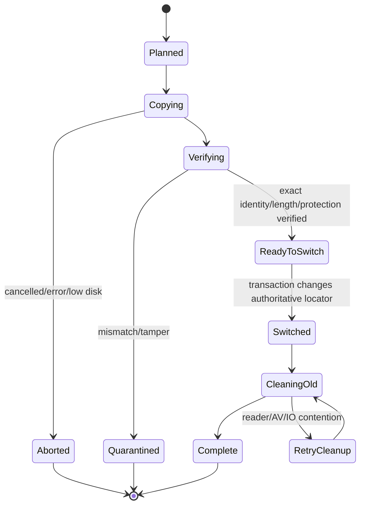

# BlobStore lifecycle and physical backends

## 1. Purpose

`BlobStore` is the sole logical owner of captured and derived payload bytes. Domain/event/representation records reference immutable blob identity and never duplicate payload bytes in metadata rows. Physical placement is an implementation detail selected by a versioned policy and must not change digest, protection, fidelity, provenance, or reference semantics.

## 2. Logical identity

### Ordinary raw/derived payloads

- logical ID: digest suite plus digest value, initially `sha256-raw-v1`;
- digest input: exact logical stored bytes, not format metadata, normalized text, compression wrapper, database encoding, or physical path;
- additional validation: exact length, protection domain, and allowed content class;
- deduplication: only within a compatible protection domain;
- event/occurrence records remain distinct when one blob is shared.

### Private/sensitive payloads

- logical/storage ID: random opaque identifier;
- no persistent plaintext digest or default plaintext deduplication;
- ciphertext envelope and key metadata follow the encryption design;
- physical backend policy cannot expose plaintext equality.

## 3. Physical locator

A blob object has one authoritative current locator:

- `SqliteBlob { row_id, storage_policy_version }`; or
- `ExternalFile { relative_object_key, storage_policy_version }`.

The locator is storage metadata, not part of the immutable clip/representation identity. Absolute paths are never persisted. External object keys are validated relative names under a controlled data root and never derived from user paths/titles.

During migration, one authoritative locator and one candidate locator may coexist under an explicit migration state. Readers use only the authoritative locator until commit.

## 4. Backend-selection policy

Selection considers:

- payload length and streamability;
- ordinary versus encrypted protection domain;
- format class and expected access pattern;
- current low-disk/database-size policy;
- selected threshold/version from benchmark evidence;
- existing deduplicated object location.

Rules:

1. Reuse an existing compatible blob regardless of the current threshold unless a separate migration is scheduled.
2. Do not migrate on the synchronous capture-critical path.
3. Threshold changes affect new unique payloads first; existing objects migrate only through bounded maintenance.
4. Policy is deterministic for the same inputs/version and observable in diagnostics without payload content.
5. No threshold is called universally optimal; release reports name hardware, dataset, Defender/AV state, and confidence.

## 5. Internal SQLite BLOB commit

For a bounded payload selected for internal storage:

1. validate policy/length/protection and compute permitted logical identity while copying from owned bytes;
2. begin the capture/storage transaction;
3. look up an existing compatible blob object by logical identity and length;
4. if absent, insert the blob object and payload bytes through the selected ordinary/incremental BLOB path;
5. verify bytes written/length and update representation/reference rows;
6. commit atomically with metadata/reference changes;
7. on rollback/crash, no committed representation references an incomplete internal blob;
8. later integrity checks recompute/verify digest according to policy without loading unrelated history.

Large/unknown streams are not forced into memory merely to qualify for internal storage.

## 6. External-file commit

For external storage:

1. create an unguessable staging file under a restricted staging directory using safe create semantics;
2. stream owned input while enforcing size/deadline/disk reserve and computing the permitted identity;
3. flush/close according to the selected durability policy;
4. look up an existing compatible blob object;
5. if an existing object is valid, discard staging and reference it;
6. otherwise atomically move staging to a controlled final object key when supported;
7. commit blob-object locator plus representation/reference metadata in SQLite;
8. if the database commit fails after finalization, the final file is an unreferenced candidate and is removed only by reconciliation after a grace/recheck;
9. if crash occurs before finalization, staging cleanup handles the incomplete file.

Final paths never expose plaintext titles, source paths, format names, or raw sensitive digests.

## 7. Reads

1. resolve blob object/reference/protection policy through the sole database owner;
2. snapshot the authoritative locator/version;
3. open an internal BLOB handle or external file with validated root-relative resolution;
4. validate expected length and integrity/authentication according to domain;
5. stream or return bounded owned bytes to the authorized consumer;
6. do not automatically parse/open/execute content;
7. if locator changes through migration, existing open readers may finish against their snapshot while cleanup waits for reader/reference safety.

## 8. Backend migration

Migration is deferred, cancellable, and never runs on the clipboard/control/UI critical path.

State machine:

Requirements:

- candidate bytes are fully written and verified before switch;
- switch is one SQLite transaction and preserves logical blob ID/reference count;
- crash before switch leaves old authoritative location valid and candidate removable;
- crash after switch leaves new location authoritative and old location removable after recheck;
- cleanup never deletes the last verified copy;
- encrypted migration never writes plaintext staging;
- migration progress/locator state is schema-versioned and upgrade-tested.

## 9. Recovery and reconciliation

Startup performs bounded/indexed reconciliation, not a full payload scan:

- incomplete staging older than a safe grace period;
- external final objects with no committed blob locator;
- locators referencing missing files/rows;
- interrupted migration states;
- reference counts inconsistent with referencing rows;
- internal/external length/state mismatch;
- low-disk cleanup state.

Full digest/integrity verification is explicit, incremental, cancellable, and rate-limited. Corrupt or missing blobs are quarantined at metadata level while unaffected history remains usable.

## 10. Deletion and retention

1. remove visible event/representation/index references transactionally according to policy;
2. decrement shared blob references;
3. when final reference is gone, schedule physical internal-row or external-file deletion;
4. encrypted items also remove key/envelope references according to the encryption design;
5. retry AV/reader-contended external deletion without re-exposing content;
6. apply selected SQLite checkpoint/`secure_delete`/vacuum policy for internal rows and indexes;
7. never claim forensic erasure from SQLite pages/WAL/journals, filesystem metadata, SSDs, snapshots, backups, or exports.

Pinned/protected references are not automatically removed to satisfy the 5 GB ordinary-cleanup target.

## 11. Backup, restore, export, and import

- A consistent backup includes SQLite plus all referenced external objects and journal/sidecar handling appropriate to the selected mode.
- Backup captures one logical snapshot/generation; copying the database and object directory at unrelated times is not called a verified backup.
- Restore validates schema, locator roots, identity/length/protection, and missing/orphan objects before exposing history.
- Import cannot choose a path outside controlled roots and cannot execute/open payloads.
- Portable encrypted backup remains a separate key/format design; raw DPAPI-bound storage is not described as portable.

## 12. Low-disk behavior

- reserve/hysteresis thresholds account for database growth, journal/WAL, external staging, migration candidates, and required metadata writes;
- pause new payload capture before exhaustion while never blocking the source application's copy;
- keep content-free health/capture-degraded state according to privacy policy;
- cancel/defer migration, previews, thumbnails, and regenerable derived work before deleting user originals;
- never silently delete pinned/protected data;
- resume only after reserve plus hysteresis recovers and storage health checks pass.

## 13. Required evidence

- threshold sweeps across 64 B–10 MiB realistic payloads, duplicate ratios, 100k/1M histories, warm/cold cache, and Defender/AV enabled;
- durable write/read/preview/search/export/backup/delete/cleanup/file-count/database-size measurements;
- internal ordinary/incremental BLOB and external streaming paths;
- crash injection at every internal commit, external stage/finalize/reference, migration switch/cleanup phase;
- dedup/reference races under the single owner;
- low-disk reserve/hysteresis and AV/file-lock contention;
- backend migration preserves logical identity, protection, reference count, immutable provenance, and search results;
- Private/sensitive equal plaintext remains unlinkable through persistent identifiers/backend metadata;
- backup/restore with both backends and interrupted migration;
- deletion-remnant inspection for DB pages/FTS/WAL/journal/external filesystem paths.
