# Clipboard lifecycle

## State machine

```mermaid
stateDiagram-v2
    [*] --> Idle
    Idle --> Notified: WM_CLIPBOARDUPDATE
    Notified --> Ignored: duplicate/self-generated sequence
    Notified --> Opening: new sequence
    Opening --> Retrying: clipboard busy
    Retrying --> Opening: bounded jitter delay
    Retrying --> Failed: retry budget exhausted
    Opening --> Enumerating: IDataObject/clipboard opened
    Enumerating --> Denied: hard-deny or capture policy
    Enumerating --> Capturing: allowed format set
    Capturing --> Persisting: immediate safe representations ready
    Capturing --> Partial: some formats unavailable/unsafe
    Persisting --> Durable: metadata + blobs committed
    Partial --> Persisting: honest fidelity recorded
    Durable --> Enriching: optional deferred jobs
    Durable --> Confirmed: no deferred work
    Enriching --> Confirmed: validated derived output committed
    Enriching --> Confirmed: worker failed/cancelled; original remains
    Denied --> Confirmed: optional metadata-only event
    Failed --> Confirmed: metadata-only diagnostic state
    Confirmed --> Idle
    Ignored --> Idle
```

## Notification handling

- `WM_CLIPBOARDUPDATE` is a signal to inspect state, not proof of a unique copy operation.
- Read `GetClipboardSequenceNumber` immediately on the message thread.
- Compare against the most recently handled sequence and active Pastral paste transaction.
- Coalesce rapid equivalent notifications without suppressing meaningful source/timestamp occurrences unless fixture evidence supports it.
- Never schedule OCR, decode large images, parse HTML, or execute database scans from the window procedure.

## Clipboard access retry

Clipboard ownership contention is expected. Retry policy requirements:

- short total deadline;
- small bounded attempt count;
- jitter to avoid synchronized contention;
- cancellation on newer sequence where safe;
- no blocking wait on the source process;
- metadata-only failure diagnostics with result/error code and duration;
- no unbounded sleep or polling loop.

Exact timings are selected through contention fixtures and capture-latency benchmarks.

## Format enumeration

Preferred order:

1. obtain a short-lived OLE `IDataObject` where available;
2. enumerate `FORMATETC` values and supported `TYMED` combinations;
3. inspect registered privacy/history flags before payload capture;
4. capture common interoperable formats with strict lengths;
5. inspect standard Win32 format enumeration for formats not represented as expected through OLE;
6. classify custom formats by allowlisted adapter, opaque-safe serialization, isolated parser, reference-only, or unsupported state.

Format priority for replay is recorded separately from capture order.

## Immediate capture policy

Immediate capture includes only work necessary to preserve data before the clipboard owner changes or exits:

- copy HGLOBAL-backed bounded bytes;
- stream IStream data to staged storage;
- duplicate/convert handle-based formats only through documented safe adapters;
- record unavailable or unsafe media honestly;
- avoid decoding when encoded bytes can be preserved directly;
- preserve multiple simultaneous representations in the same event.

## Source context

Capture source context with confidence and privacy labels:

- foreground process and executable identity;
- package identity where applicable;
- top-level window class;
- title only according to profile privacy policy and redaction;
- browser/domain/project signals only from reliable integration or conservative inference;
- fullscreen, remote-session, monitor, and active profile state for overlay/rule decisions.

Source metadata must never delay clipboard release materially.

## Sensitive-content path

Priority order:

1. clipboard-owner hard-deny format;
2. application/package denylist;
3. reliable private-context exclusion;
4. high-confidence sensitive detector;
5. profile allow/deny and retention policy;
6. ordinary classification/rules.

Default high-confidence secret handling:

- do not persist payload;
- do not hash payload;
- do not create preview, OCR, snippet, derivative, or duplicate relation;
- optionally persist a `SensitiveItemSkipped` event with policy ID, broad class, timestamp bucket according to privacy settings, and no reconstructable value;
- passive overlay displays no secret or source detail.

## Persistence transaction

A logical capture transaction records:

- event identity and sequence metadata;
- source/profile/policy result;
- format descriptors;
- blob references finalized from staging;
- fidelity per representation and aggregate event fidelity;
- transformation/work queue intents;
- correlation ID for metadata-only diagnostics.

If a database commit fails after a final blob rename, recovery treats the blob as temporarily unreferenced and removes it only after a safe grace period. If a crash occurs before rename, staging cleanup applies.

## Deferred enrichment

Enrichment begins only after durable capture and may include:

- safe text normalization for indexing while preserving originals;
- thumbnails;
- sanitized HTML preview;
- syntax/language detection;
- OCR after its module exists;
- optional later local semantic vectors.

Each result is a derived representation or metadata record with versioned provenance. Cancellation or failure never removes the original.

## Retention lifecycle

- Default age limit: 90 days.
- Default quota: 5 GB.
- Pinned items are excluded from automatic age/quota deletion.
- Derived data is deleted before an original only when it is regenerable and policy permits.
- Duplicate blob deletion occurs only when no event/derived reference remains.
- Sensitive timed retention uses explicit expiry and secure key/blob deletion semantics.
- Maintenance is incremental and interruptible; no full-history scan on every startup or timer tick.

## Session transitions

Handle lock, unlock, suspend, resume, user switch, shutdown, and crash:

- optionally clear private-profile in-memory keys on lock;
- stop overlays before lock/suspend;
- do not assume clipboard owner/data remains available after resume;
- recover storage before accepting new captures;
- re-register listener/hotkeys only when required by observed Windows behavior;
- test rapid shutdown during staging and database commit.
