# Clipboard lifecycle

## State machine

```mermaid
stateDiagram-v2
    [*] --> Idle
    Idle --> Observed: WM_CLIPBOARDUPDATE
    Observed --> Ignored: equivalent/validated self-generated current state
    Observed --> Queued: bounded observation handoff
    Queued --> Opening: clipboard-platform STA selects current observation
    Opening --> Retrying: clipboard busy
    Retrying --> Opening: bounded jitter delay
    Retrying --> Audit: retry budget exhausted
    Opening --> Enumerating: Win32 formats opened
    Enumerating --> HardDenied: source-owned hard deny
    Enumerating --> PolicyDenied: user/app/profile deny
    Enumerating --> Capturing: allowed adapter set
    Capturing --> Persisting: one or more representations ready
    Capturing --> Partial: some formats unavailable/unsafe
    Capturing --> Audit: no representation captured
    Persisting --> DurableClip: metadata + blobs committed
    Partial --> Persisting: honest fidelity recorded
    DurableClip --> Enriching: optional deferred jobs
    DurableClip --> Confirmed: no deferred work
    Enriching --> Confirmed: validated derived output committed
    Enriching --> Confirmed: worker failed/cancelled; original remains
    PolicyDenied --> Audit: optional content-free policy event
    HardDenied --> Confirmed: no durable record
    Audit --> Confirmed: content-free audit committed when policy permits
    Confirmed --> Idle
    Ignored --> Idle
```

## Notification handling

- `WM_CLIPBOARDUPDATE` is a signal to inspect the current state, not proof of a unique copy operation; it carries no event identity.
- Read `GetClipboardSequenceNumber` immediately on the control thread and handle zero/wrap/delayed-render semantics described in `clipboard-event-identity.md`.
- Snapshot cheap source/foreground evidence, active profile/policy version, and active Pastral transaction marker.
- Post a bounded `ClipboardObservation` to the dedicated clipboard-platform STA and return from the window procedure.
- Sequence equality alone never proves self-generation; validate the private origin marker and transaction/ownership timing.
- Coalesce only equivalent current-state observations. Identical content copied again remains a meaningful event when separately observed and captured.
- Under pressure, prioritize the final current state and record possible intermediate-state loss honestly; Windows provides no historical clipboard-state queue.
- Never call foreign `IDataObject`, schedule OCR, decode large images, parse HTML, wait, or execute database work from the control window procedure.

## Clipboard access retry

Clipboard ownership contention is expected. Retry policy requirements:

- short total deadline;
- small bounded attempt count;
- jitter to avoid synchronized contention;
- cancellation on newer sequence where safe;
- no blocking wait on the source process;
- metadata-only failure diagnostics with result/error code and duration;
- no unbounded sleep or polling loop.

Exact timings are selected through contention fixtures and capture-latency benchmarks.

## Format enumeration

Accepted hybrid order on the clipboard-platform STA:

1. open/inspect the current Win32 clipboard and enumerate registered privacy/history flags before payload reads where technically possible;
2. enumerate standard and registered Win32 format identities;
3. capture reviewed common formats through format-specific adapters with strict lengths and ownership rules;
4. obtain a short-lived OLE `IDataObject` only for adapters that require `FORMATETC`, `lindex`, `IStream`, virtual-file, or richer medium semantics;
5. copy foreign media into Pastral-owned storage and release it on the clipboard-platform STA;
6. classify unknown custom formats as metadata-only/unsupported by default, not opaque-replayable merely because bytes are obtainable.

Registered formats are persisted by exact name, not runtime numeric ID. Format priority for replay is recorded separately from capture order. See `clipboard-format-policy.md`.

## Immediate capture policy

Immediate capture includes only work necessary to preserve data before the clipboard owner changes or exits:

- copy HGLOBAL-backed bounded bytes;
- stream IStream data to staged storage;
- duplicate/convert handle-based formats only through documented safe adapters;
- record unavailable or unsafe media honestly;
- avoid decoding when encoded bytes can be preserved directly;
- preserve multiple simultaneous representations in the same event.

## Source context

Capture source context with evidence type, confidence, and privacy labels as defined in `source-context.md`:

- clipboard-owner HWND/process evidence where valid;
- foreground process/window snapshot at notification time;
- package/executable stable identity where permitted;
- top-level window class;
- title only according to profile privacy policy and redaction;
- browser/domain/project signals only from explicit integration or user assignment;
- fullscreen, remote-session, monitor, and active profile state for overlay/rule decisions.

`GetOpenClipboardWindow` is contention evidence, not source attribution. Missing or conflicting evidence remains `Unknown`/low confidence. Source metadata must never delay clipboard release materially.

## Sensitive-content path

Priority order:

1. clipboard-owner hard-deny format;
2. application/package denylist;
3. reliable private-context exclusion;
4. high-confidence sensitive detector;
5. profile allow/deny and retention policy;
6. ordinary classification/rules.

Default high-confidence secret handling:

- do not persist payload;
- do not hash payload;
- do not create preview, OCR, snippet, derivative, or duplicate relation;
- persist a hidden `SensitiveItemSkipped` audit event by default for 24 hours containing policy/detector class, active profile, and coarse timestamp only;
- omit source title, path, domain, payload size, value structure, and reconstructable metadata;
- allow the user to disable or shorten this audit retention;
- passive overlay displays no secret or source detail.

Source-owned hard-deny formats are stricter: no durable clip or audit event is created.

## Persistence transaction

A successful logical capture transaction records:

- opaque event identity plus observation/sequence evidence;
- source/profile/policy result with confidence;
- stable format descriptors using standard IDs or registered names;
- one or more captured representations;
- blob references finalized from staging;
- fidelity per representation and aggregate event fidelity;
- transformation/work queue intents;
- correlation ID for metadata-only diagnostics.

If no representation succeeds, create a content-free `CaptureAuditEvent` only when policy permits; never create a zero-representation `ClipEvent`.

If a database commit fails after a final blob rename, recovery treats the blob as temporarily unreferenced and removes it only after a safe grace period. If a crash occurs before rename, staging cleanup applies.

## Deferred enrichment

Enrichment begins only after durable capture and may include:

- safe text normalization for indexing while preserving originals;
- thumbnails;
- sanitized HTML preview;
- syntax/language detection;
- OCR after its module exists;
- optional later local semantic vectors.

Each result is a derived representation or metadata record with versioned provenance. Cancellation or failure never removes the original.

## Retention lifecycle

- Default age limit: 90 days.
- Default automatic-cleanup target: 5 GB for ordinary unpinned history.
- Pinned/protected items are excluded from automatic age/quota deletion and may exceed the target with visible warnings.
- Derived data is deleted before an original only when it is regenerable and policy permits.
- Duplicate blob deletion occurs only when no event/derived reference remains.
- Sensitive timed retention uses explicit expiry and secure key/blob deletion semantics.
- Maintenance is incremental and interruptible; no full-history scan on every startup or timer tick.

## Session transitions

Handle lock, unlock, suspend, resume, user switch, shutdown, and crash:

- optionally clear private-profile in-memory keys on lock;
- stop overlays before lock/suspend;
- do not assume clipboard owner/data remains available after resume;
- recover storage before accepting new captures;
- re-register listener/hotkeys only when required by observed Windows behavior;
- test rapid shutdown during staging and database commit.
