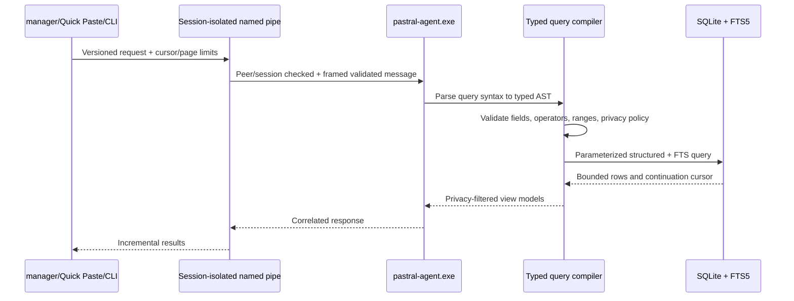
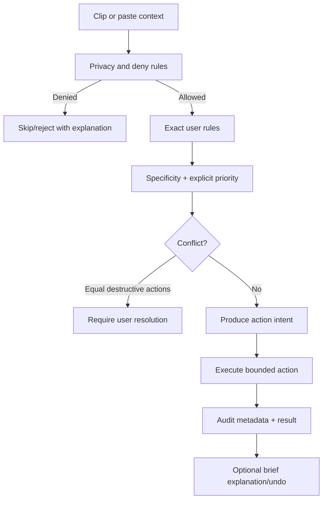
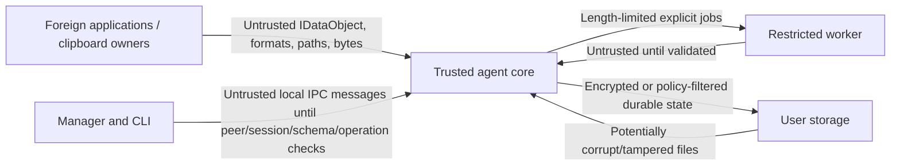

# Data flow

## Capture and enrichment flow

```mermaid
sequenceDiagram
    participant Src as Source application
    participant Win as Windows clipboard
    participant Control as Agent control/overlay thread
    participant Capture as Agent clipboard STA
    participant Policy as Capture policy
    participant Store as SQLite/blob store
    participant Worker as pastral-worker.exe
    participant Overlay as Passive overlay

    Src->>Win: Publish clipboard IDataObject/formats
    Win-->>Control: WM_CLIPBOARDUPDATE
    Control->>Win: GetClipboardSequenceNumber
    Control->>Control: Snapshot transaction/source evidence
    Control->>Capture: Post bounded ClipboardObservation
    Control-->>Win: Return from window procedure
    Capture->>Win: Bounded OpenClipboard retry
    Win-->>Capture: Standard/registered format set
    Capture->>Policy: Privacy flags + source evidence + safe lightweight signals
    alt Source-owned hard deny
        Policy-->>Capture: Hard deny
        Capture-->>Control: Ephemeral suppressed state; no durable row
    else High-confidence secret
        Policy-->>Capture: Skip payload
        Capture->>Store: Hidden content-free SensitiveItemSkipped (24h default)
        Capture-->>Control: Privacy-safe skipped status when enabled
    else Capture allowed
        Capture->>Capture: Capture reviewed Win32 adapters
        opt Adapter requires OLE semantics
            Capture->>Win: Short-lived OleGetClipboard / FORMATETC request
            Win-->>Capture: Foreign IDataObject / STGMEDIUM
        end
        Capture->>Store: Pastral-owned staged blobs + metadata transaction
        Store-->>Capture: Durable clip ID / recovery token
        Capture-->>Control: Immutable confirmation view model
        Control->>Overlay: Show focus-safe confirmation
        opt Expensive or hostile enrichment enabled
            Capture->>Worker: Bounded staged input job
            Worker-->>Capture: Validated descriptor + output hash
            Capture->>Store: Commit derived representation
        end
    end
    Capture->>Win: Release foreign clipboard/data object on clipboard STA
```

## Query flow



## Rule evaluation flow



## Blob commit flow

Ordinary payload commit is designed around recoverable staging:

1. create an unpredictable temporary file in the blob staging directory;
2. stream bytes while enforcing size limits and computing the selected hash;
3. flush and close the staging handle according to durability policy;
4. derive the final content-addressed path for non-sensitive data;
5. atomically rename when possible, accepting an existing identical blob;
6. commit metadata references in SQLite;
7. recovery reconciliation removes orphan staging files and identifies unreferenced final blobs after grace periods.

Sensitive payload flow differs:

- encrypt before durable final placement;
- use random blob identifiers and no persistent plaintext digest/deduplication by default;
- store versioned envelope metadata;
- never use plaintext equality as a filename or public index;
- do not create searchable preview or derivative metadata without explicit policy.

## Trust boundaries



Every arrow crossing into the agent is validated. Same-user origin is not equivalent to trusted input, and the pipe protocol is not claimed as a strong confidentiality boundary against a fully compromised same-user process.

## Data minimization

- Source titles and paths are redacted or omitted according to profile policy.
- Logs contain opaque identifiers, durations, size buckets, standard format IDs or registered-format names according to redaction policy, and result codes—not payloads or unstable runtime registered-format IDs.
- Search snippets are generated only from indexed non-sensitive data and obey preview policy.
- Paste occurrence tracking is optional and stores metadata, not destination document content.
- Diagnostic bundles sanitize usernames, paths, titles, domains, package identities, and clip IDs according to export level.
