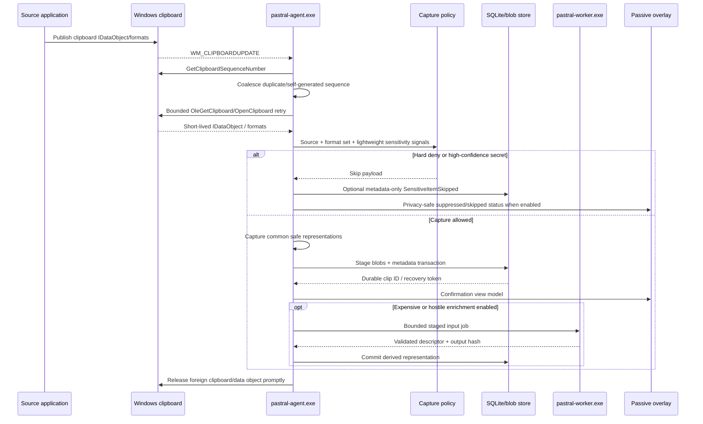
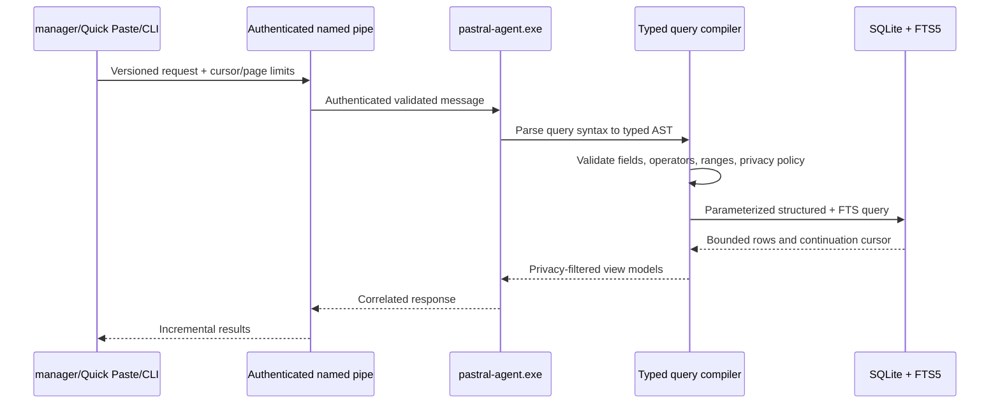
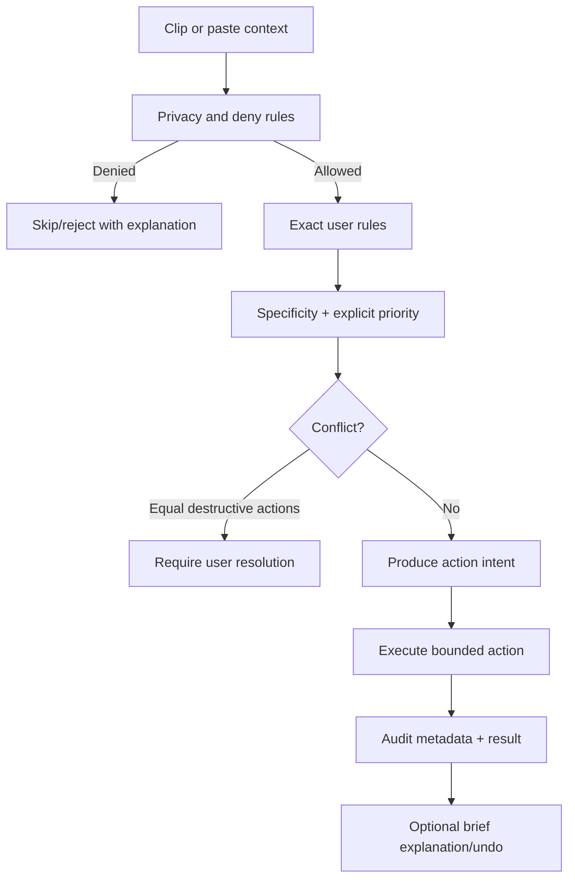
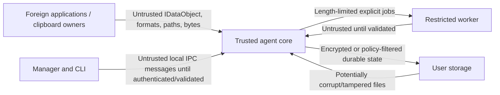

# Data flow

## Capture and enrichment flow

## Query flow

## Rule evaluation flow

## Blob commit flow

Ordinary payload commit is designed around recoverable staging:

1. create an unpredictable temporary file in the blob staging directory;
2. stream bytes while enforcing size limits and computing the selected hash;
3. flush and close the staging handle according to durability policy;
4. derive the final content-addressed path for non-sensitive data;
5. atomically rename when possible, accepting an existing identical blob;
6. commit metadata references in SQLite;
7. recovery reconciliation removes orphan staging files and identifies unreferenced final blobs after grace periods.

Sensitive payload flow differs:

- encrypt before durable final placement;
- use random blob identifiers or keyed hashes;
- store versioned envelope metadata;
- never use plaintext equality as a filename or public index;
- do not create searchable preview or derivative metadata without explicit policy.

## Trust boundaries

Every arrow crossing into the agent is validated. Same-user origin is not equivalent to trusted input.

## Data minimization

- Source titles and paths are redacted or omitted according to profile policy.
- Logs contain identifiers, durations, sizes, format IDs, and result codes, not payloads.
- Search snippets are generated only from indexed non-sensitive data and obey preview policy.
- Paste occurrence tracking is optional and stores metadata, not destination document content.
- Diagnostic bundles sanitize usernames, paths, titles, domains, package identities, and clip IDs according to export level.
