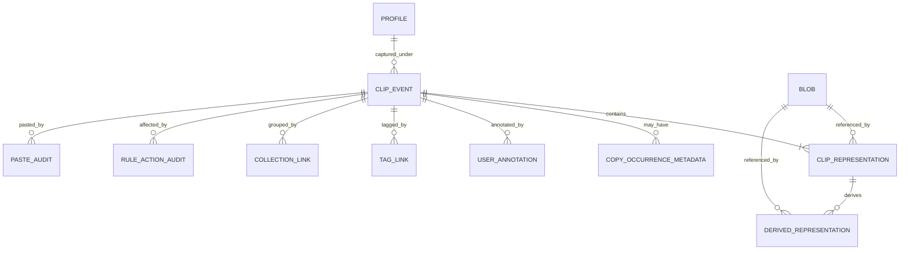

# Domain data model and invariants

## 1. Model layers

Pastral separates immutable captured truth from mutable user organization and operational audit.

### Immutable capture core

- `ClipEvent`
- `ClipRepresentation`
- `SourceContextSnapshot`
- raw format descriptor
- capture policy/version result
- original fidelity and unavailable-format reasons
- observed UTC time/order and originating observation evidence

These fields are append-only. Corrections create explicit superseding metadata or migration records; user actions never rewrite captured bytes or original provenance.

### Derived immutable content

- `DerivedRepresentation`
- `TransformationRecord`
- transformation version/parameters
- parent representation/event ID
- output digest/encryption envelope identity
- fidelity/quality notes

Re-running a transformation creates another version rather than mutating a prior output.

### Mutable user state

- pin/favorite state;
- tags and collection membership;
- user notes;
- profile assignment only when an explicit move policy preserves the original capture profile separately;
- hidden/deleted/tombstone state;
- preferred paste representation/action;
- explicit relationship/grouping.

Mutable state has its own version/audit fields and is not included in the original-content digest.

### Operational/audit state

- `CaptureAuditEvent`;
- paste occurrence/result when enabled;
- rule match/action audit;
- retention/deletion/migration/recovery events;
- health/diagnostic counters.

Audit records are content-free by schema, retention-bounded, and never stand in for a captured clip.

## 2. Core entities

### ClipboardObservation

Transient only.

Required fields:

- `observation_id` — opaque UUIDv4;
- `observed_at_utc_us`;
- `observed_monotonic_ticks`;
- `observation_ordinal` scoped to the current agent process;
- optional clipboard sequence plus `sequence_available`;
- active instance/session/profile/policy version;
- active Pastral paste transaction marker;
- source evidence snapshot;
- lifecycle state/result.

It is removed after the resulting clip/audit/ignored outcome and diagnostics have been committed or discarded.

### ClipEvent

Required invariants:

- opaque stable `clip_event_id`;
- at least one `ClipRepresentation`;
- exactly one immutable capture-profile snapshot;
- one observed UTC timestamp, originating per-process observation ordinal, and durable installation-local `capture_order` assigned by the storage transaction;
- aggregate fidelity derived deterministically from representation states;
- no payload bytes inline in metadata except explicitly bounded small-value storage selected by a later storage schema decision;
- no sensitive-skip/denied/failure placeholder represented as a clip;
- immutable original representation membership after commit. Late recovery of a format creates an explicitly linked supplement event/representation only under a future accepted design, not silent mutation.

### ClipRepresentation

Required fields/invariants:

- opaque stable ID;
- parent `ClipEvent` ID;
- stable format identity: standard ID or registered name;
- adapter/version;
- captured medium/source descriptor;
- raw byte length or reference metadata;
- blob/envelope reference where stored;
- digest suite/value only where policy permits;
- fidelity state;
- capture result and limitation notes;
- ordinal/priority from the source format set where observable;
- exactly one ownership/storage state: `StoredRaw`, `StoredNormalizedOriginalAdapter`, `ReferenceOnly`, or `UnavailableMetadataOnly`.

A metadata-only unavailable descriptor can describe a format offered by the source, but it does not satisfy the requirement that a `ClipEvent` have at least one captured representation.

### DerivedRepresentation

Required fields/invariants:

- opaque stable ID;
- parent representation/event IDs;
- transformation ID and semantic version;
- canonical parameter encoding and policy version;
- created UTC time;
- output blob/envelope and permitted digest;
- deterministic-output flag/hash only when the transformation guarantees determinism;
- fidelity/quality/security notes;
- revocation/invalidated state without mutation of original output bytes.

### CaptureAuditEvent

Allowed classes:

- `SensitiveItemSkipped`;
- user/application/profile policy deny when audit is enabled;
- clipboard unavailable/retry exhausted;
- no supported representation;
- storage low-disk/unavailable;
- integrity quarantine/recovery;
- possible observation pressure/intermediate-state loss aggregate.

It cannot contain:

- payload bytes or fragments;
- content/plaintext/keyed digest;
- exact secret length/structure;
- preview, OCR, snippet, title, URL, domain, file path, project, command line, or image dimensions for sensitive skip;
- a blob reference capable of reconstructing skipped content.

Source-owned history hard deny creates no durable audit event.

## 3. Relationships

`CaptureAuditEvent` is intentionally separate from `ClipEvent` and has no content/blob relationship.

## 4. Identity and ordering

- Public IDs follow ADR 0016.
- Database foreign keys use stable binary domain IDs or internal surrogates with a mandatory unique stable-ID column; protocol never exposes a row ID.
- Default history/pagination order uses durable installation-local `capture_order` plus stable event ID; civil time is displayed and filterable but does not override true local capture order after clock rollback.
- `observation_ordinal` is origin evidence only and may restart at process launch.
- Alternate chronological views may sort by observed UTC time, then `capture_order`, then event ID, and must label clock anomalies honestly.
- Import/merge assigns new local `capture_order` values while retaining original UTC/provenance; a verified whole-vault restore may preserve the complete local order domain.
- Copy occurrences remain separate even when ordinary payload blobs deduplicate.
- A duplicate stack is a view/query relation, not an irreversible merge.

## 5. Blob identity and protection domains

- Ordinary raw representation bytes use persisted digest suite `sha256-raw-v1`: SHA-256 over the exact stored bytes, with no text normalization or format metadata mixed into the digest.
- Byte length, format identity, adapter version, and protection domain remain separate metadata and are checked before reusing an existing blob.
- Ordinary deduplication occurs only inside a compatible ordinary protection domain and never merges distinct `ClipEvent` records.
- Private/sensitive plaintext uses random blob identifiers, no persistent plaintext digest, and no default plaintext deduplication.
- Derived output computes its own permitted digest over its own exact bytes and retains parent/transformation provenance.
- Digest suite/version is persisted so future suites coexist through explicit migration rather than silently reinterpreting old values.

## 6. Fidelity aggregation

Representation fidelity values:

- `FullFidelity`
- `CommonFormatsPreserved`
- `FallbackOnly`
- `ReferenceOnly`
- `Unavailable`
- `UnsafeOrUnsupported`

Event aggregate rules are pure/versioned:

- `FullFidelity` only when the source's reviewed replay-relevant format set is captured and known unsupported/private formats do not undermine the claim;
- `CommonFormatsPreserved` when supported interoperable formats are captured but universal/private fidelity is not claimed;
- `FallbackOnly` when only a fallback such as Unicode text survives;
- `ReferenceOnly` only when all usable representations are references whose target may later disappear;
- unavailable/unsafe descriptors do not become separate history cards.

The exact aggregation function and version are persisted/tested; UI may show per-representation details rather than oversimplifying.

## 7. Profile semantics

- Every event records immutable `captured_profile_id` and policy snapshot.
- Reorganizing an item into another profile does not erase its original capture profile; it creates current-placement metadata or a copy/link according to the later profile design.
- A Private-profile event uses the Private protection domain from initial commit and cannot be silently downgraded/moved into ordinary unencrypted storage.
- Cross-profile duplicate detection never crosses a Private/sensitive protection domain by default.

## 8. Delete/tombstone semantics

Logical deletion:

1. mark user-visible references/tombstone transactionally;
2. remove FTS/index rows according to policy;
3. decrement blob references;
4. delete final blob only after no active reference remains and recovery grace has passed;
5. delete/wipe key envelope for encrypted content;
6. clean journals/freelists according to the selected SQLite policy without claiming forensic erasure;
7. preserve only required content-free audit/tombstone metadata for bounded recovery/audit period.

Undo/recycle-bin design, if enabled, is explicit retained data and counts toward storage/privacy reporting.

## 9. Serialization and migration

- Domain enums use explicit numeric/string tags with unknown-value handling; Rust/C++ enum ordinal layout is never serialized directly.
- All IPC/export/storage schemas have major/minor or schema version.
- Required invariants are validated on deserialization and migration, not assumed from database constraints alone.
- Unknown future fields can be ignored only when the schema marks them non-security-critical; unknown action/format/encryption variants fail safe.
- Migrations never recompute original bytes or silently alter fidelity labels without recording the aggregation/version change.

## 10. Required tests

- zero-representation clip rejected;
- one/multiple representations accepted;
- unavailable descriptors do not satisfy captured representation cardinality;
- immutable original mutation rejected;
- mutable annotation update leaves original digest/provenance unchanged;
- UUIDv4 version/variant/canonical serialization and collision-retry path;
- wall clock repeats/moves backward and agent restarts while durable `capture_order` remains deterministic and gap-safe;
- duplicate ordinary bytes share blob without merging events;
- Private/sensitive equal plaintext does not share blob or equality index;
- hard deny creates no durable row;
- sensitive audit schema rejects forbidden fields;
- profile move preserves captured profile and protection domain;
- migration from each supported schema preserves IDs, times, bytes, and provenance.
