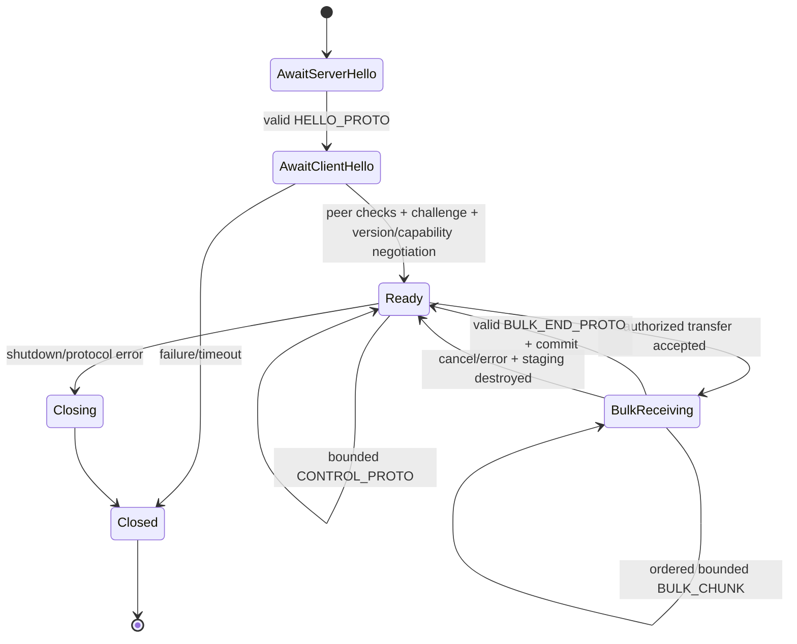

# IPC schema, framing, and transfer state machine

ADR 0018 proposes Protobuf Edition 2024 for bounded control metadata and a fixed 36-byte frame header for named-pipe transport. Framing/schema rules are accepted for prototype; the resident runtime implementation remains gated on footprint/build/security evidence. This document defines implementation-facing invariants; `ipc-security-model.md` defines who may connect and which operations require user intent.

## 1. Layering

```text
Named pipe byte stream
  └─ Pastral 36-byte frame header
      ├─ Protobuf control body
      └─ Raw authorized bulk chunk body
          └─ staging/validation/commit state machine
```

Transport framing, schema parsing, domain conversion, authorization, and storage are separate stages. A valid frame/Protobuf message is not automatically a valid or authorized domain request.

## 2. Connection state



Rules:

- no frame except the expected hello is accepted before `Ready`;
- protocol/security failure closes the connection after at most one bounded safe error;
- no automatic retry loop inside the server; client backoff is bounded;
- handshake and idle timeouts are event-driven and cancellation-safe;
- connection state stores no clipboard payload after request/transfer completion.

## 3. Frame parser

The header layout is normative and matches ADR 0018:

| Offset | Size | Field |
|---:|---:|---|
| 0 | 4 | magic `PSTR` |
| 4 | 2 | framing major |
| 6 | 2 | frame kind |
| 8 | 4 | flags |
| 12 | 4 | body length |
| 16 | 4 | frame sequence |
| 20 | 16 | correlation/transfer UUID |

The parser:

1. reads exactly 36 header bytes with cancellation;
2. validates magic, framing major, known kind, reserved flags, frame sequence, UUID usage, and body limit using checked arithmetic;
3. allocates at most the validated body ceiling or selects a bounded streaming sink;
4. reads exactly `body_length` bytes;
5. rejects trailing/truncated cross-frame confusion;
6. dispatches by current connection/transfer state;
7. zeroes/drops sensitive temporary buffers where practical.

Do not cast unaligned pipe bytes to a native C/Rust struct. Decode each field explicitly as little-endian and test on arbitrary alignment. Generated Protobuf parsers never receive more than the 256 KiB control ceiling.

Header validation bounds the body buffer, not every internal parser allocation. Configure recursion/total-byte/arena limits where the selected runtime supports them, fuzz and measure parser peak allocation at the ceiling, and perform no domain allocation or expensive operation until post-parse validation passes.

## 4. Protobuf envelope rules

The prototype may use `pastral.ipc.v1` as a centralized generated-code namespace. It is not a wire-level authorization or product identity, and it must remain replaceable before the first public protocol/package identity freeze.

Logical envelopes:

- `ServerHello`
- `ClientHello`
- `RequestEnvelope`
- `ResponseEnvelope`
- `EventEnvelope`
- `BulkOpenRequest/Response`
- `BulkEnd`
- `ProtocolError`

`ServerHello`/`ClientHello` negotiate protocol major/minor and capabilities and bind them to connection state. The frame-header correlation UUID is the sole request/response/event correlation authority; control bodies do not duplicate it. Domain IDs and bulk transfer IDs have distinct field names and cannot grant capabilities or authorization.

Every post-handshake envelope has exactly one known-operation `oneof`. The conversion layer rejects:

- no recognized operation;
- multiple/ambiguous semantic operations after future compatibility transforms;
- zero/unknown security-critical enum;
- absent required explicit-presence field;
- duplicate key in repeated key/value collections;
- invalid UUID byte length/version/variant when UUIDv4 is required;
- invalid UTF-8 semantic constraints, NUL/path/title policy, timestamp range, integer overflow, excessive nesting/count/string length;
- capability not negotiated;
- deadline already expired or outside allowed range;
- domain invariant or operation authorization failure.

Unknown Protobuf fields are not an authorization signal. Unknown future fields can coexist only when the recognized operation remains fully valid under the negotiated minor/capability set.

## 5. Schema evolution

- Never renumber or reinterpret a published field.
- Reserve deleted field numbers and names permanently.
- Additive optional fields require a defined absent behavior.
- Additive enum values require old receivers either to reject safely or treat them only as informational; actions/policies never silently fall back.
- Changing units, byte domains, protection meaning, authorization, or required invariants is a new field/message or protocol major—not a comment-only change.
- `oneof` membership changes receive compatibility fixtures.
- IPC DTOs are never database/export schema authority.
- Adjacent-version golden fixtures are stored as binary bytes plus human-readable schema/version metadata.

## 6. Bulk transfer state

A bulk transfer record contains:

- transfer UUID;
- connection and authorized operation binding;
- direction;
- source domain object/representation/export ID;
- protection/sensitivity class;
- maximum bytes and chunk count, both bounded so the 32-bit frame sequence cannot wrap;
- received/sent bytes and next sequence;
- deadline/cancellation token;
- private staging target;
- permitted raw/ciphertext digest policy;
- final commit/result state.

Security/correctness rules:

- no transfer opens without an authorized control request;
- chunk bytes never enter logs or Protobuf error details;
- each `BULK_CHUNK` carries an explicit zero-based frame sequence and `BULK_END_PROTO` sequence equals accepted chunk count;
- duplicate, skipped, reordered, wrong-connection, wrong-direction, post-cancel, or excess chunk destroys the staging transfer;
- disconnect destroys incomplete receive staging;
- sender reads only the authorized immutable resource/range;
- receiver checks disk reserve/quota continuously;
- commit is atomic only after exact length/final policy/digest validation;
- sensitive/Private transfer does not create a plaintext equality digest;
- cancellation is idempotent and cannot commit partial content.

## 7. Error model

Errors expose:

- stable non-sensitive category/code;
- correlation UUID;
- retryability and required next action;
- optional bounded developer detail/result code according to diagnostics policy.

Errors never expose payload, search text, secret-derived metadata, raw path/title/domain, encryption key/nonce, challenge secret, pipe name, token details, stack dump, or arbitrary parser input.

Malformed/untrusted requests receive less detail than validated first-party clients. Repeated protocol violations close the connection without an oracle-like response stream.

## 8. Dependency and footprint gate

Before accepting the protocol implementation slice:

- pin the exact supported generator/generated-code/runtime artifacts for C++ and Rust according to the official per-language compatibility policy;
- record licenses/transitive/native dependencies and generated-code commands;
- prototype the official Rust kernel/Cargo path and at least one credible actively maintained wire-compatible Rust alternative;
- build the Rust agent protocol crate without Tokio/gRPC/reflection/JSON/TextFormat;
- prototype C++ control messages with lite runtime where supported;
- measure incremental binary size, private working set, startup, parse/serialize latency, allocation count, malformed-input behavior, and update compatibility;
- compare against a minimal hand-framed baseline only to validate the budget, not to bypass schema safety casually;
- amend ADR 0018 with the selected runtime or alternative if the resident budget/build gates fail.

Initial release-train candidate is Protocol Buffers v35.0 with Edition 2024 schemas; revalidate on the actual prototype date and do not conflate the release-train number with every language package major.

## 9. Required tests

- every 36-byte header field boundary, unaligned input, truncation, overflow, invalid magic/version/kind/flag/sequence/UUID;
- byte-mode transport splits at every header/body byte, one byte per read, short writes/reads, multiple complete and partial frames coalesced in one read, and no dependence on `WriteFile` or Windows message boundaries;
- body length zero/max/max+1 and slow/disconnected reader/writer;
- Protobuf deep nesting, repeated/string limits, unknown fields/actions/enums, absent explicit presence, duplicate key records;
- reserved-field compatibility and golden adjacent-version round trips in Rust and C++;
- exact compiler/runtime mismatch fails build/verification rather than shipping;
- hello order/replay/stale challenge/wrong instance/session;
- request correlation collision/duplicate/cancel/timeout/late response;
- capability negotiation and unsupported action;
- bulk open/chunk/end happy path plus duplicate/gap/reorder/wrong connection/direction/sequence/count/length/digest/cancel/disconnect/low disk;
- sensitive/Private error/log/correlation paths contain no content/equality metadata;
- fuzz frame parser, protobuf parser with post-parse validator, DTO-domain conversion, and transfer state machine;
- agent footprint/performance evidence with protocol linked but idle.
