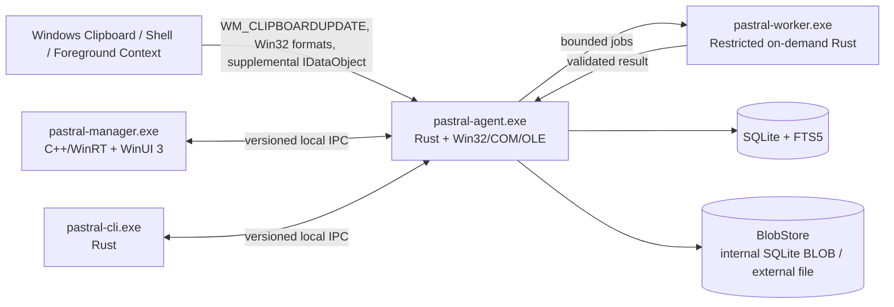

# Architecture overview

## System shape

Pastral uses a native multi-process architecture with one small always-running agent and on-demand UI/worker processes.

## Dependency direction

- Domain models depend on no Windows or database implementation.
- Platform clipboard adapters depend on domain format abstractions, not storage.
- Capture/replay orchestration depends on domain, policy, clipboard adapters, storage interfaces, and worker scheduler; all clipboard/OLE ownership remains inside the dedicated clipboard platform apartment.
- Storage implements domain repositories and owns SQLite plus the `BlobStore` abstraction; internal SQLite BLOB versus external-file placement is a versioned benchmark-selected policy.
- Search parses typed queries and compiles parameterized SQL/FTS through storage interfaces.
- Overlay consumes immutable view models and emits action intents.
- Manager and CLI consume only IPC contracts.
- No manager, overlay, or worker opens the primary SQLite database directly.

## Executables

### pastral-agent.exe

Lifetime: user session, optionally auto-started.
Technology: Rust, Win32, COM/OLE, Windows APIs.
Owns:

- control/overlay message thread and message-only clipboard listener window;
- dedicated clipboard platform STA for foreign Win32/OLE calls/media and Pastral replay-object publication/lifetime;
- clipboard observation, sequence/coalescing, and capture-health state;
- capture and paste orchestration;
- lightweight classification and deterministic rule evaluation;
- database and blob-store ownership;
- authenticated local IPC server;
- global hotkeys and tray icon;
- passive overlay and explicit interactive transition;
- worker launch/control;
- health and metadata-only diagnostics.

Must not load the full manager UI, OCR engine, browser engine, scripting runtime, or semantic model.

### pastral-worker.exe

Lifetime: only while jobs exist.
Technology: Rust plus narrowly selected native codecs/parsers.
Owns:

- OCR after its later design;
- thumbnail/preview generation;
- HTML sanitization and complex format parsing;
- syntax detection;
- optional later local semantic indexing.

Runs with bounded input/output, time, memory, process tree, privileges, filesystem access, and no network capability by default.

### pastral-manager.exe

Lifetime: user-invoked and single-instance per logon session; it may remain alive briefly according to an explicit bounded warm-lifetime policy after UI closure.
Technology: C++20, C++/WinRT, WinUI 3, stable Windows App SDK.
Owns:

- Quick Paste as an activation mode/window;
- history/library management;
- search/filter editing experience;
- profiles, rules, collections, sources, storage, privacy, diagnostics, onboarding, and release information;
- UI Automation, localization, high contrast, text scaling, keyboard/touch interactions.

Business logic remains in Rust domain/services behind IPC.

### pastral-cli.exe

Lifetime: command execution.
Technology: Rust.
Owns status, pause/resume, profile switch, search, export, health, integrity, rules, performance report, and sanitized diagnostics. It never prints clip content unless an explicit content-output flag is provided.

## Storage ownership

The agent is the single schema/migration and write owner. Manager/CLI requests are serialized into service operations through IPC. Worker output is returned to the agent, validated, then persisted by the agent.

Benefits:

- one migration authority;
- simpler WAL/rollback and backup semantics;
- no UI process holding database locks;
- one location for retention, encryption, audit, and redaction policy;
- crash isolation for complex parsing without giving worker broad storage authority.

## Thread and event model

The agent avoids a continuously running general async executor. Accepted responsibilities:

- a control/overlay message thread for listener HWND, tray, hotkeys, session/power messages, capture supervision, and overlay coordination; it never invokes foreign clipboard `IDataObject` methods;
- a dedicated clipboard platform STA initialized with `OleInitialize` and a message pump; all foreign clipboard/OLE interfaces/media plus Pastral replay-object publication/lifetime remain there;
- a bounded storage/CPU work queue using Windows thread-pool primitives or a small measured Rust abstraction;
- a serialized database owner context;
- named-pipe I/O using overlapped handles/IOCP or a measured equivalent;
- worker process completion through job objects and completion notifications.

The control thread converts `WM_CLIPBOARDUPDATE` into a bounded transient `ClipboardObservation`. A durable `ClipEvent` exists only after at least one representation is captured and committed. COM cancellation is best effort; a stuck clipboard-platform STA degrades capture and replay availability visibly rather than freezing control surfaces or being terminated unsafely. See `threading-and-com-apartments.md` and ADR 0015.

## Data principles

- A clipboard notification maps to a transient observation, not automatically to a durable clip.
- One successful captured clipboard state maps to one logical `ClipEvent` containing at least one representation, not one card per format.
- Denied/failed/skipped observations use separate content-free audit records where policy permits; source-owned hard deny creates no durable row.
- Originals are immutable.
- Derived outputs preserve provenance.
- Ordinary duplicate payloads may share logical blobs while occurrences remain distinct; physical backend does not alter identity/provenance.
- Ordinary raw blobs use a versioned digest policy; sensitive/private payload identifiers must not reveal plaintext equality and are not deduplicated by plaintext by default.
- Standard clipboard formats persist defined IDs; registered formats persist exact names rather than runtime-local numeric IDs.
- Source claims carry evidence type and confidence; unknown source remains unknown.
- Every persisted state transition is versioned and migration-tested.

## Failure containment

- Agent capture failure cannot block the source copy; Pastral does not claim every intermediate state is recoverable during extremely rapid clipboard replacement.
- A blocked foreign clipboard call cannot directly block tray/hotkey/overlay/session handling because it runs on the clipboard-platform STA; it may still degrade capture/replay until restart or a future broker split.
- Worker crash cannot crash the agent.
- Manager crash cannot corrupt the database.
- Overlay rendering/device loss falls back or suppresses itself.
- Unsupported/malformed formats are skipped or isolated.
- Paste failure cannot alter stored originals.
- Low disk space suspends payload capture safely and communicates state without storing clipboard content in diagnostics.

## Architecture change control

An ADR is required before adding:

- another resident process;
- another database writer;
- network communication;
- in-process third-party plugins;
- a scripting runtime;
- a managed runtime to the agent;
- direct manager database access;
- a new OS support baseline;
- a broad persistent background job.
