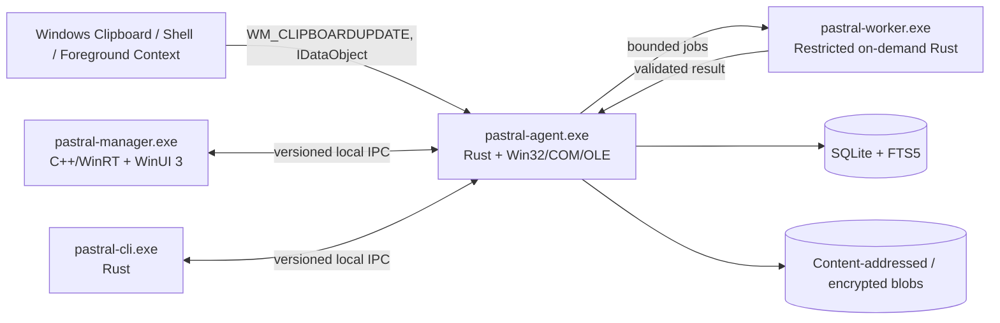

# Architecture overview

## System shape

Pastral uses a native multi-process architecture with one small always-running agent and on-demand UI/worker processes.

## Dependency direction

- Domain models depend on no Windows or database implementation.
- Platform clipboard adapters depend on domain format abstractions, not storage.
- Capture orchestration depends on domain, policy, clipboard adapters, storage interfaces, and worker scheduler.
- Storage implements domain repositories and owns SQLite/blob details.
- Search parses typed queries and compiles parameterized SQL/FTS through storage interfaces.
- Overlay consumes immutable view models and emits action intents.
- Manager and CLI consume only IPC contracts.
- No manager, overlay, or worker opens the primary SQLite database directly.

## Executables

### pastral-agent.exe

Lifetime: user session, optionally auto-started.
Technology: Rust, Win32, COM/OLE, Windows APIs.
Owns:

- message-only/hidden clipboard listener window;
- sequence-number/coalescing state;
- capture and paste orchestration;
- lightweight classification and deterministic rule evaluation;
- database and blob-store ownership;
- authenticated local IPC server;
- global hotkeys and tray icon;
- passive overlay and explicit interactive transition;
- worker launch/control;
- health and metadata-only diagnostics.

Must not load the full manager UI, OCR engine, browser engine, scripting runtime, or semantic model.

### pastral-worker.exe

Lifetime: only while jobs exist.
Technology: Rust plus narrowly selected native codecs/parsers.
Owns:

- OCR after its later design;
- thumbnail/preview generation;
- HTML sanitization and complex format parsing;
- syntax detection;
- optional later local semantic indexing.

Runs with bounded input/output, time, memory, process tree, privileges, filesystem access, and no network capability by default.

### pastral-manager.exe

Lifetime: user-invoked.
Technology: C++20, C++/WinRT, WinUI 3, stable Windows App SDK.
Owns:

- history/library management;
- search/filter editing experience;
- profiles, rules, collections, sources, storage, privacy, diagnostics, onboarding, and release information;
- UI Automation, localization, high contrast, text scaling, keyboard/touch interactions.

Business logic remains in Rust domain/services behind IPC.

### pastral-cli.exe

Lifetime: command execution.
Technology: Rust.
Owns status, pause/resume, profile switch, search, export, health, integrity, rules, performance report, and sanitized diagnostics. It never prints clip content unless an explicit content-output flag is provided.

## Storage ownership

The agent is the single schema/migration and write owner. Manager/CLI requests are serialized into service operations through IPC. Worker output is returned to the agent, validated, then persisted by the agent.

Benefits:

- one migration authority;
- simpler WAL/rollback and backup semantics;
- no UI process holding database locks;
- one location for retention, encryption, audit, and redaction policy;
- crash isolation for complex parsing without giving worker broad storage authority.

## Thread and event model

The initial agent design avoids a continuously running general async executor. Expected responsibilities:

- STA message thread for HWND, clipboard/OLE interactions, tray/hotkey messages, and overlay coordination where required;
- bounded storage/CPU work queue using Windows thread-pool primitives or a small measured Rust abstraction;
- serialized database owner context;
- named-pipe I/O using overlapped handles/IOCP or a measured equivalent;
- worker process completion through job objects and completion notifications.

COM apartment choice is finalized with fixture evidence because some clipboard/OLE sources have apartment-sensitive behavior.

## Data principles

- One clipboard update maps to one logical `ClipEvent`, not one card per format.
- Originals are immutable.
- Derived outputs preserve provenance.
- Ordinary duplicate payloads may share blobs while occurrences remain distinct.
- Sensitive payload identifiers must not reveal equality.
- Every persisted state transition is versioned and migration-tested.

## Failure containment

- Agent capture failure cannot block the source copy.
- Worker crash cannot crash the agent.
- Manager crash cannot corrupt the database.
- Overlay rendering/device loss falls back or suppresses itself.
- Unsupported/malformed formats are skipped or isolated.
- Paste failure cannot alter stored originals.
- Low disk space suspends payload capture safely and communicates state without storing clipboard content in diagnostics.

## Architecture change control

An ADR is required before adding:

- another resident process;
- another database writer;
- network communication;
- in-process third-party plugins;
- a scripting runtime;
- a managed runtime to the agent;
- direct manager database access;
- a new OS support baseline;
- a broad persistent background job.
