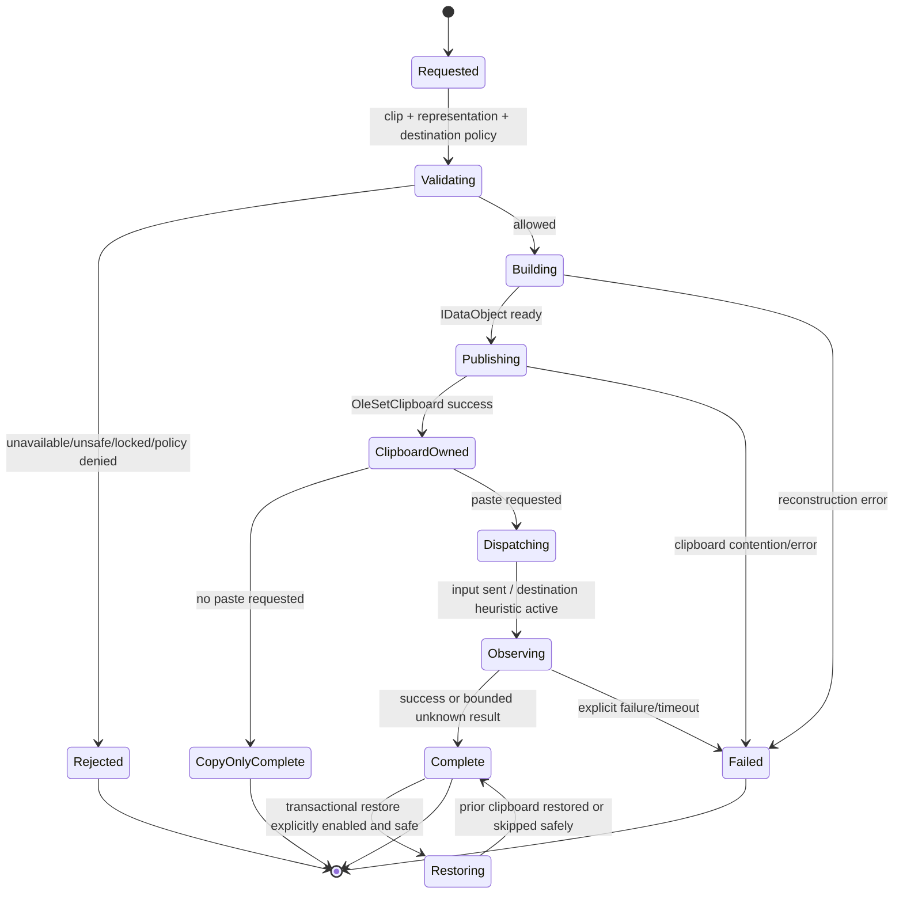

# Paste lifecycle

## Objectives

A paste transaction reconstructs the safest highest-fidelity representation set requested by the user, publishes it to the Windows clipboard, optionally invokes paste in the intended foreground destination, and preserves stored originals regardless of outcome.

## State model

## Request inputs

A transaction specifies:

- clip ID;
- requested representation or `preferred`/`original` policy;
- paste mode: copy only, paste, type Unicode fallback, file/path/name, sequential queue, or derived output;
- destination snapshot and compatibility profile;
- whether previous clipboard restoration is requested;
- user interaction/correlation ID;
- privacy and sensitive-unlock state.

## Validation

Before touching the clipboard:

- verify clip and blob integrity;
- authorize sensitive/private-profile access;
- reject deleted, expired, corrupt, unsupported, or unsafe representations;
- evaluate destination deny/compatibility policy;
- resolve deterministic representation priority;
- ensure file references still exist or report `ReferenceOnly`;
- cap reconstructed aggregate size and delayed-render lifetime;
- preserve a metadata-only result path.

## IDataObject construction

The replay object is created, published, and kept alive on the dedicated clipboard platform STA. It:

- offers all safe preserved representations needed for original/preferred modes;
- includes interoperable fallbacks such as Unicode text alongside rich formats when valid;
- reconstructs standard formats from documented fixed IDs and registered formats by re-registering their persisted exact names; runtime numeric registered-format IDs are never replay identities;
- records captured enumeration order as evidence but uses adapter/compatibility policy for replay priority; it does not claim that all destinations honor enumeration order consistently;
- owns all memory/stream lifetime through RAII;
- implements only required `IDataObject` operations and validates `FORMATETC`/`TYMED`, `dwAspect`, and `lindex` requests through registered adapters;
- supports delayed rendering where it improves memory behavior and compatibility, using only prevalidated owned memory or immutable pre-opened blob/stream resources;
- never performs SQLite, IPC, rule, profile, or UI queries from `IDataObject` callbacks;
- never exposes worker staging paths or internal encrypted blobs directly.

Derived or plain-text modes publish only the selected derived set plus appropriate fallback metadata; they do not mutate stored originals.

## Clipboard publication

- Serialize publication/retirement with capture ownership on the clipboard platform STA and use `OleSetClipboard` for OLE-aware multi-format replay.
- Publish a versioned private origin marker and track ownership/sequence timing as evidence for self-generated suppression; sequence equality alone is insufficient.
- Keep the data object alive until the destination has consumed it or the bounded lifetime policy resolves.
- Use `OleIsCurrentClipboard`/`OleFlushClipboard` only where transaction and shutdown semantics require them.
- Never restore the prior clipboard immediately after synthetic paste; many destinations read asynchronously.

## Destination invocation

Preferred order is compatibility-profile dependent:

1. return focus to the explicitly recorded destination only when Quick Paste had been user-invoked and Windows permits safe restoration;
2. revalidate destination HWND, process lifetime identity, session, and available integrity evidence immediately before dispatch;
3. send the configured paste gesture through documented input APIs only when the destination remains expected;
4. observe bounded heuristics such as clipboard ownership/read patterns and foreground changes;
5. report `Dispatched`, explicit failure, or `UnknownConsumed` honestly; synthetic input success is not proof that the destination consumed data;
6. use Unicode typing only as an explicit compatibility fallback, never silently for rich content.

`SendInput` is subject to UIPI and cannot inject into a higher-integrity destination from Pastral's standard-user process. Pastral does not request `uiAccess`, elevate itself, install a service, or use focus-stealing/thread-attachment hacks to bypass this restriction. When focus restoration or dispatch is blocked/uncertain, it leaves the selected data on the clipboard and displays a concise manual-paste instruction.

Pastral must not paste into a newly foregrounded unrelated application if destination identity changed after user selection.

## Previous clipboard restoration

Restoration is off by default for ordinary history paste because early restoration can break destinations.

When explicitly enabled:

- capture the prior clipboard through the same safety policy;
- wait for a destination-read heuristic or conservative timeout chosen per compatibility profile;
- verify Pastral still owns the current clipboard before restoration;
- skip restoration if another application/user changed the clipboard;
- publish the previous data object with the same lifetime guarantees;
- record metadata-only result and reason.

No heuristic is described as certain unless destination-specific evidence supports it.

## Failure behavior

- Reconstruction failure leaves the Windows clipboard unchanged where possible.
- Publication failure does not remove or alter stored data.
- Synthetic-input failure, UIPI restriction, or uncertain focus restoration leaves the selected item on the clipboard so the user can paste manually.
- Destination change, integrity mismatch, or uncertain restoration/dispatch cancels synthetic paste rather than risking a wrong target.
- Corrupt or tampered encrypted blobs are quarantined and reported without plaintext logging.
- Agent crash or blocked clipboard-platform STA during delayed rendering is covered by shutdown/restart, degraded paste availability, and `OleFlushClipboard` compatibility tests; no callback performs storage/business work that could deadlock the core.

## Compatibility evidence

Test original, rich, plain, copy-only, and fallback modes against:

- Explorer;
- Notepad;
- Word, Excel, PowerPoint;
- Edge, Chrome, Firefox;
- VS Code and Visual Studio;
- Windows Terminal, PowerShell, Command Prompt;
- Discord and Slack;
- standard Win32 edit controls;
- WinForms and WPF controls;
- Pastral fixture destinations that inspect exact offered formats and bytes.

Each application profile records:

- accepted stable format identities (standard ID or registered name) and priority;
- asynchronous-read behavior;
- paste shortcut/input constraints, destination integrity/elevation behavior, and manual-paste fallback;
- restoration safety;
- known failures and workarounds;
- tested application/Windows version and date.

## Privacy and diagnostics

Logs may contain:

- transaction ID;
- standard format IDs or registered format names according to redaction policy, plus size buckets;
- source/destination application identifiers according to redaction policy;
- timings;
- result/error codes;
- compatibility-profile version.

Logs never contain payload bytes, pasted text, image pixels, file contents, private keys, tokens, or secret fragments.
