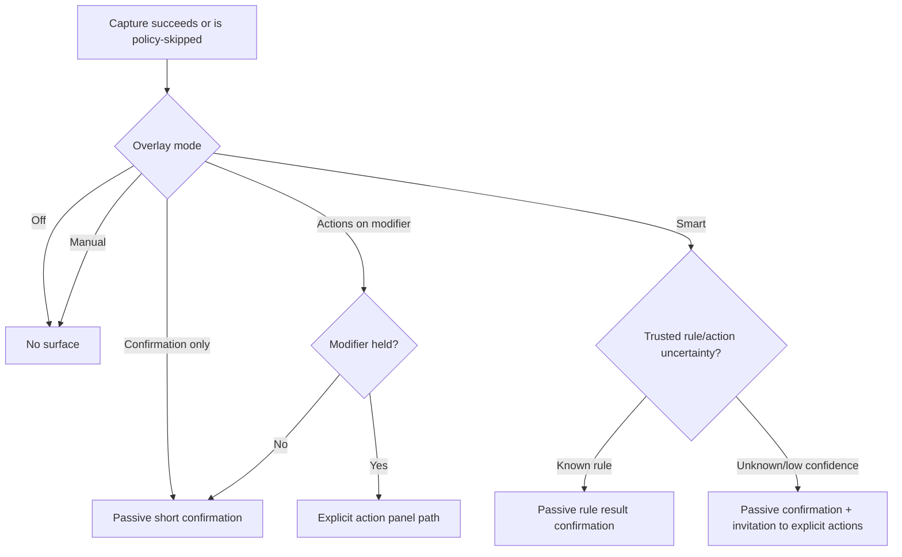

# Interaction specification

## 1. Interaction model

Pastral has three distinct interaction states:

1. **Passive observation:** agent captures and may show a non-activating confirmation.
2. **Explicit quick interaction:** user invokes Quick Paste or expands an overlay into an interactive surface.
3. **Management:** user opens the manager for organization, policy, diagnostics, or long operations.

Transitions between states are explicit. Passive state never silently becomes focused/interactive.

## 2. Focus and activation invariants

### Passive overlay

- does not become foreground, active, or focused;
- does not change the focused control in the source application;
- does not register global number/Escape handling;
- mouse click cannot activate the passive HWND;
- no taskbar button or Alt+Tab entry;
- dismisses through time/policy, not stolen keyboard input;
- pointer interaction either invokes a separately modeled explicit panel without activating the passive window itself or is disabled, depending on prototype evidence.

### Quick Paste

- takes focus only after an explicit configured hotkey/tray/menu command;
- opens on the monitor associated with the intended foreground window;
- records the intended destination before activation;
- restores or dispatches to that destination only after identity revalidation;
- closing/cancelling returns focus safely when the destination still exists;
- never pastes into a different newly foregrounded application.

### Manager

Uses normal top-level activation and Windows navigation behavior. It never controls typing in another app unless the user explicitly invokes a paste command and destination validation succeeds.

## 3. Keyboard behavior

### Global commands

Only user-configured, conflict-checked hotkeys may be global:

- open Quick Paste;
- pause/resume capture;
- switch profile;
- show manual action panel;
- optional paste queue command.

Global hooks do not intercept ordinary typing. Registration failure is visible and recoverable.

### Quick Paste defaults

| Key | Action |
|---|---|
| Type | Edit search query |
| Up/Down | Move result selection when result list owns navigation |
| Enter | Paste preferred representation |
| Shift+Enter | Paste plain text |
| Ctrl+Enter | Copy selected representation without pasting |
| Alt+Enter | Open clip details |
| Ctrl+P | Toggle pin when search box standard behavior is not affected |
| Delete | Apply configured delete confirmation/undo policy |
| Tab/Shift+Tab | Move between search, results, preview/actions |
| Esc | Close current explicit surface or step back; never global |

Number shortcuts work only when an interactive surface visibly presents numbered actions and owns focus.

### Search box

Preserve standard editing shortcuts including selection, word movement, clipboard operations, undo/redo, IME behavior, and accessibility input. Product shortcuts cannot override them.

## 4. Pointer, touch, and pen

- Passive overlay pointer behavior does not activate the passive window.
- Interactive rows have one primary selection/paste action and a discoverable context menu.
- Hover-only controls are also keyboard/touch accessible.
- Touch mode increases spacing/hit regions without removing information.
- Drag and drop begins only after threshold movement and never exposes encrypted/internal blob paths.
- Pen follows pointer semantics; no pen-only core action.

## 5. Copy feedback flow

No passive state captures keyboard commands.

## 6. Rule-learning interaction

1. Pastral detects a supported action opportunity.
2. User explicitly chooses an action.
3. A compact follow-up offers:
   - use once;
   - remember for this app;
   - remember for this content type;
   - edit scope/rule.
4. Broad scopes are never preselected without clear explanation.
5. Simulation shows match facts and action result before save.
6. Later matches show optional brief confirmation.
7. Undo offers:
   - revert this result where possible;
   - suppress rule temporarily;
   - edit/disable rule.

A user-enabled repeated-choice learner may recommend a rule after a threshold, but recommendation never creates a broad rule silently.

## 7. Paste interaction

Before paste:

- selected clip/representation and intended destination are explicit;
- compatibility/fidelity warnings appear when decision-relevant;
- sensitive/private clips require configured authorization;
- unavailable references explain the failure and alternatives.

After paste:

- success feedback is brief;
- unknown destination consumption is stated honestly;
- failure leaves content on the clipboard for manual paste when safe;
- no modal dialog appears over the destination unless the user returns to Pastral.

## 8. Deletion, retention, and undo

- Single ordinary deletion uses undo where recoverable.
- Pinned deletion requires a clearer confirmation than unpinned deletion.
- Sensitive timed expiry is automatic according to explicit policy and not undoable after key/blob removal.
- Bulk deletion previews scope, pinned exclusions, profiles, and derived/original effects.
- “Clear history” is not adjacent to ordinary actions without separation.
- Database repair never silently deletes questionable items; quarantine/report first where possible.

## 9. Privacy-state interactions

### Paused capture

- tray and manager show persistent state;
- passive overlay may show one brief “Capture paused” confirmation after user action, not on every copy;
- duration/end condition is visible;
- resume is explicit.

### Sensitive item skipped

- no content preview or secret-derived icon/text;
- wording such as “Sensitive content not saved” only in configured privacy-safe status surfaces;
- source details, size, structure, and precise timestamp omitted;
- hidden audit entry contains only broad detector/policy class, active profile, coarse timestamp, and expires after 24 hours by default;
- action links lead to policy settings, not a reveal of discarded content.

### Source-owned hard deny

- no durable clip or audit row;
- no content/source preview or rule action;
- passive overlay is suppressed by default; an explicitly enabled generic policy notice may state only “Not saved by source policy” and is not retained;
- settings cannot override the storage deny.

### Private profile unavailable or locked

- before encrypted storage/non-indexing/recovery gates exist, the built-in Private profile is shown only as unavailable with prerequisite explanation, not as an unencrypted functional profile;
- when implemented and locked, cards expose type/count/time only according to minimized metadata policy;
- accessibility tree contains no hidden content;
- search does not reveal protected terms;
- unlock flow does not steal focus from an unrelated destination.

## 10. Error states

Errors are categorized by user impact:

- **Capture degraded:** current source copy still succeeded; explain formats or storage unavailable.
- **Storage unavailable/low disk:** payload capture paused or reduced; provide storage action.
- **Agent unavailable:** manager/Quick Paste cannot access history; safe restart/recovery action.
- **Protocol mismatch:** update/restart required; no direct database fallback.
- **Corrupt item:** item quarantined; original reference not pasted.
- **Paste rejected:** destination changed, policy denied, representation unavailable, or authorization missing.
- **Manual paste required:** focus restoration or synthetic input was blocked/uncertain (including higher-integrity destinations); item remains on clipboard and the message contains a keyboard-accessible manual-paste instruction without payload content.

Messages contain a clear outcome and next action, not raw HRESULTs. Diagnostics disclosure may show result codes separately.

## 11. Localization and layout

- Copy/action labels remain concise but are not abbreviated into ambiguity.
- Dynamic source/profile names may be long and contain RTL/Unicode.
- Keyboard shortcut display follows locale/platform conventions.
- Date/time, number, byte size, and pluralization are localized.
- Search query field names have stable invariant aliases plus localized display/help.
- RTL mirrors layout and directional transitions; provenance order remains semantically clear.

## 12. Interaction acceptance gates

A surface is not complete until tests prove:

- focus/foreground invariants;
- keyboard reachability and standard shortcut preservation;
- UI Automation semantics;
- pointer/touch equivalence;
- high contrast/text scaling/reduced motion;
- sensitive content absence from passive/accessibility surfaces;
- cancellation and recovery for long requests;
- all loading, empty, error, locked, denied, and overflow states.
